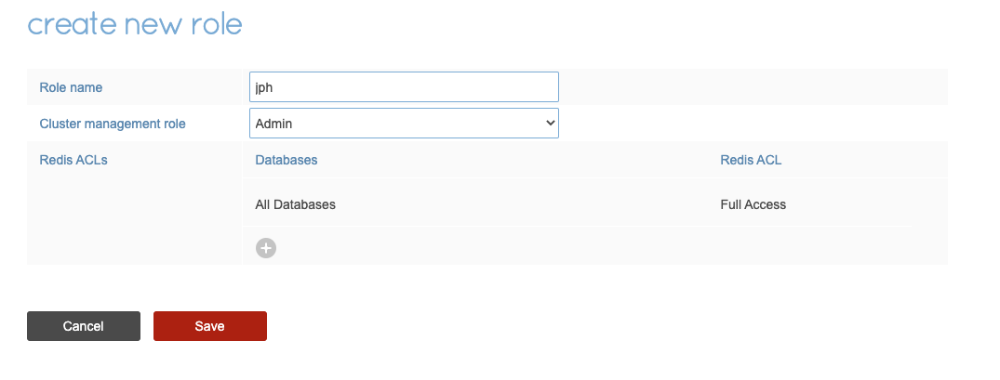
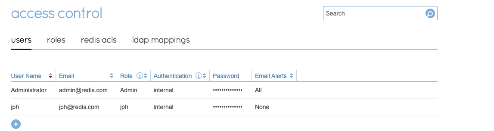
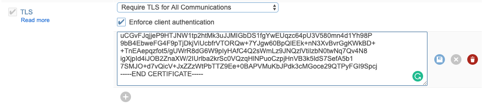

# RediSentinel and TLS with multiple client libraries

## Outline

- [Overview](#overview)
- [Important Links](#important-linksnotes)
- [Deploy git](#deploy-github)
- [Deploy redis](#deploy-redis)
  - [Deploy on docker](#deploy-on-docker)
    - [Deploy redis with TLS](#deploy-redis-with-tls)
    - [Verify with redis-cli](#verify-using-redis-cli)
    - [Deploy Redis Sentinel with TLS](#deploy-redis-sentinel-with-tls)
    - [Verify sentinel using redis-cli](#verify-sentinel-using-redis-cli)
  - [Deploy Redis Enterprise](#deploy-redis-enterprise)
    - [Deploy Redis Enterprise without TLS](#deploy-redis-enterprise-database-without-tls)
    - [Verify access to the database](#verify-access-to-the-database)
    - [Prepare database](#prepare-database)
    - [Verify connectivity to database](#verify-connectivity-to-database)
    - [Setup TLS for Redis Enterprise](#setup-tls-for-redis-enterprise)
    - [Redis Enterprise with Sentinel](#redis-enterprise-with-sentinel)
    - [Verify Redis Enterprise Connectivity](#verify-redis-enterprise-connectivity)
    - [Set up Sentinel TLS](#set-up-sentinel-tls)
    - [Verify redis enterprise sentinel tls](#verify-redis-enterprise-sentinel-tls)


## Overview
This github shows code to connect to redis enterprise and redis-stack using sentinel and/or TLS.  Links provided in this github, show redisson sentinel with TLS as well.  Additional steps are needed on the redis enterprise server if sentinel is used with TLS-these steps are also provided.  Redis enterprise as a standalone redis can be used or a docker solution based on redis stack.   Each client tool is in a separate subdirectory with a separate README.md as the main directory holds all the docker-compose files.  This README covers the database deployment.  Trying to give as broad a set of working examples in the TLS and sentinel space with a variety of client tools such as jedis, spring jedis, lettuce, spring lettuce, python, and node.js.

## Deploy github
```bash
get clone https://github.com/jphaugla/redisSentinel.git
```

## Important Links
- [GitHub deploying this java application with redis enterprise on AWS](https://github.com/jphaugla/tfmodule-aws-redis-enterprise)
- [Generate a self-signed SSL certificate for IP address](https://medium.com/@antelle/how-to-generate-a-self-signed-ssl-certificate-for-an-ip-address-f0dd8dddf754)
- [Redis CLI with tls](https://redis.io/docs/ui/cli)
- [TLS with redis](https://redis.io/docs/management/security/encryption/)
- [TLS with redis docker](https://blog.shahid.codes/setup-redis-with-tls-using-docker)
- [Enabling Secure Connections to Redis Enterprise](https://redis.com/blog/enabling-secure-connections-to-redis-enterprise/)
- [SSL/TLS with Redis Enterprise blog](https://tgrall.github.io/blog/2020/01/02/how-to-use-ssl-slash-tls-with-redis-enterprise/)
- [Where to install redis certiciate-springboot](https://www.appsloveworld.com/springboot/100/95/where-to-install-redis-certificate)
- [mTLS/TLS with Lettuce](https://stackoverflow.com/questions/63177538/mtls-tls-redis-6-issues-java)
- [Hostname must match for TLS](https://stackoverflow.com/questions/3093112/certificateexception-no-name-matching-ssl-someurl-de-found)
- [Got Jedis SSL code from this link](https://redis.io/docs/clients/java/)
- [Use SSL/TLS wiith Redis Enterprise](https://developer.redis.com/howtos/security/)
- [Redis Sentinel open source documentation](https://redis.io/docs/management/sentinel/)
- [Redis Sentinel on docker youtube](https://www.youtube.com/watch?v=XxR6M6XQq6I)
- [Redis Sentinel with TLS stackoverflow](https://stackoverflow.com/questions/61327471/redis-6-tls-support-and-redis-sentinel)
- [Redis Sentinel with TLS guide I followed](https://www.dltlabs.com/blog/how-to-set-up-a-redis-cluster-with-tls-in-a-local-machine--679616)
- [Redis spring boot with sentinel](https://docs.spring.io/spring-data/data-redis/docs/current/reference/html/#redis:sentinel)
- [ioredis with TLS](https://github.com/luin/ioredis#sentinel)
- [Redisson github including sentinel steps](https://github.com/jphaugla/Redis-Digital-Banking-redisson/)

## Deploy redis
The following sections cover running redis-stack on docker or redis enterprise in standard TLS or Sentinel with TLS.  No changes are needed with Redis Enterpise to run sentinel without TLS-works with default installation.  Each application subdirectory will link back to the appropriate section here for the type of database setup needed to support the application.  This is a work in progress as not all combinations have been tested/completed at this time.  
### Deploy on Docker
* may need to adjust environment variables in the docker compose file for the environment
* ACL is also set in the Docker environment variable section
* TLS is built into redis-stack so this was easy enough

#### Deploy redis with TLS
* Download the latest tool from redis to generate the certificates
* Start redis using docker-compose file without TLS
* Build the certificates in the redis docker image
  * since the target directory for the certificates is docker volume mounted, the generated files will be available in the github directory as well
  * these certificates will be needed by the running application.  Each application README.md will have instructions to leverage the certificates by the application
```bash
   cd redisSentinel/scripts
   ./get-gen-test-certs.sh
   cd ..
   docker-compose -f docker-compose.no-tls.yml up -d 
   docker exec -it redis bash
#  in the docker container for redis
   apt-get update
   apt-get install openssl
   cd scripts
   ./gen-test-certs.sh
   exit
#  back in github directory
   docker-compose -f docker-compose.no-tls.yml down
```
* bring up tls redis-stack
```bash
docker-compose -f docker-compose.tls.yml up -d
```

#### Verify sentinel using redis-cli
edit scripts/app.env to have redis as REDIS_HOST and 6379 as REDIS_PORT
```bash
source scripts/app.env
cd redisSentinel
./redis-cli-redis.sh
```
* shutdown tls redis-stack
```bash
docker-compose -f docker-compose.tls.yml down
```

Go back to your application and get it connected to redis stack!

#### Deploy redis sentinel with TLS
* Setup redis sentinel without TLS and verify connectivity
```bash
   docker-compose -f docker-compose.no-tls.yml -f docker-compose.sentinel-no-tls.sh up -d 
   ./redis-cli-no-tls.sh
   set silly very
```
* verify sentinel 
```bash
./redis-cli-sentinel-no-tls.sh
127.0.0.1:26379> SENTINEL masters
1)  1) "name"
    2) "mymaster"
    3) "ip"
    4) "172.23.0.3"
    5) "port"
    6) "6379"
    7) "runid"
    8) "b57e75360cb5fe17681d55213e928db015cebff4"
    9) "flags"
   10) "master"
   11) "link-pending-commands"
   12) "0"
   13) "link-refcount"
   14) "1"
   15) "last-ping-sent"
   16) "0"
   17) "last-ok-ping-reply"
   18) "1017"
   19) "last-ping-reply"
   20) "1017"
   21) "down-after-milliseconds"
   22) "60000"
   23) "info-refresh"
   24) "4334"
   25) "role-reported"
   26) "master"
   27) "role-reported-time"
   28) "1008331"
   29) "config-epoch"
   30) "0"
   31) "num-slaves"
   32) "0"
   33) "num-other-sentinels"
   34) "0"
   35) "quorum"
   36) "2"
   37) "failover-timeout"
   38) "180000"
   39) "parallel-syncs"
   40) "1"
```
* setup redis sentinel TLS
  * Build the certificates in the redis docker image
    * using exact commands from [this redis tls webpage](https://www.dltlabs.com/blog/how-to-set-up-a-redis-cluster-with-tls-in-a-local-machine--679616)
    * since the target directory for the certificates is docker volume mounted, the generated files will be available in the github directory as well
    * these certificates will be needed by the running application.  Each application README.md will have instructions to leverage the certificates by the application
```bash
   docker exec -it redis bash
#  in the docker container for redis
   apt-get update
   apt-get install openssl
   cd scripts
   ./gen-sentinel-test-certs.sh
   exit
#  back in github directory
   docker-compose -f docker-compose.no-tls.yml -f docker-compose.sentinel-no-tls.sh down
```
* bring up sentinel tls redis-stack
```bash
docker-compose -f docker-compose.redis-sentinel-keys.sh -f docker-compose.sentinel-tls.sh up -d
```
### Verify using redis cli
edit scripts/app.env to have redis as REDIS_HOST and 6379 as REDIS_PORT
```bash
source scripts/app.env
cd redisSentinel
./redis-cli-sentinel.sh
127.0.0.1:26379> SENTINEL masters
1)  1) "name"
    2) "mymaster"
    3) "ip"
    4) "192.168.96.4"
    5) "port"
    6) "6379"
    7) "runid"
    8) "6eb9dddc076f8df2f082308e8193113153d8bf17"
    9) "flags"
   10) "master"
   11) "link-pending-commands"
   12) "0"
   13) "link-refcount"
   14) "1"
   15) "last-ping-sent"
   16) "0"
   17) "last-ok-ping-reply"
   18) "987"
   19) "last-ping-reply"
   20) "987"
   21) "down-after-milliseconds"
   22) "60000"
   23) "info-refresh"
   24) "5145"
   25) "role-reported"
   26) "master"
   27) "role-reported-time"
   28) "35300"
   29) "config-epoch"
   30) "0"
   31) "num-slaves"
   32) "0"
   33) "num-other-sentinels"
   34) "0"
   35) "quorum"
   36) "2"
   37) "failover-timeout"
   38) "180000"
   39) "parallel-syncs"
   40) "1"
```
* shutdown tls redis-stack
```bash
docker-compose -f docker-compose.redis-sentinel-keys.sh -f docker-compose.sentinel-tls.sh down
```

Go back to your application and get it connected to redis stack!

### Deploy redis enterprise
* In [this github](https://github.com/jphaugla/tfmodule-aws-redis-enterprise)), a database is created with redis search and redis json deployed.  json is needed if the environment variable WRITE_JSON is set to true.  Search is not used in this application but if curious about search, the code is *lifted* from [my github that uses search and json](https://github.com/jphaugla/redisearchStock).
* This readme is following the steps from this [TLS with Redis Enterprise github](https://developer.redis.com/howtos/security/)

#### Deploy redis enterprise database without TLS
using [redis create database documentation](https://docs.redis.com/latest/rs/databases/create/), create a database.  NOTES:  don't set up for TLS yet, set port to 12000 for simplicity, add a password to the database
edit scripts/app.env to have redis enterprise  as REDIS_HOST and 12000 as REDIS_PORT
#### Verify access to the database
* edit scripts/app.env for any differences
* verify connectivity
```bash
./redis-cli-re-no-tls.sh
set jason funny
```

#### Prepare database
Need to create an ACL in redis enterprise for the database to be used as the login (sample code uses un=jph pw=jasonrocks) for the application.  The following steps cover doing this:
* [Configure ACLs](https://docs.redis.com/latest/rs/security/access-control/configure-acl/)
* [Create Roles](https://docs.redis.com/latest/rs/security/access-control/create-roles/)
* [Manage Users](https://docs.redis.com/latest/rs/security/access-control/manage-users/)
* steps used



#### Verify connectivity to database
```bash
./redis-cli-re-no-tls-un.sh
```
#### Setup TLS for redis enterprise
* get the proxy cert from redis-enterprise
  * it is located in /etc/opt/redislabs/proxy_cert.pem
```bash
cd re_keys/tls
# this is assuming redis enterprise was built using above terraform script
scp -i aws_pem_file ubuntu@52.9.197.238:/etc/opt/redislabs/proxy_cert.pem .
./gen_client_cert.sh
# copy the generated cert file
pbcopy < client_cert_app_001.pem
```
##### Go to the Redis Enterprise Admin Web Console and enable TLS on your database:

* Edit the database configuration
* Check TLS
* Select "Require TLS for All communications"
* Check "Enforce client authentication"
* Paste the certificate in the text area
* Click the Save button to save the certificate
* Click the Update button to save the configuration.


#### Verify no longer can connect without TLS
```bash
./redis-cli-re-no-tls-un.sh
```

#### Verify can connect with TLS
NOTE:  stunnel is no longer needed so use format in  redis-cli-re-tls.sh
```bash
cd redisSentinel
./redis-cli-re-tls.sh
```
Can now go back to chosen application to connect the application to redis enterprise with TLS

## Redis Enterprise with Sentinel
Redis Enterprise does not need any configuration changes to work with Sentinel. However, using sentinel and TLS with Redis Enterprise becomes a bit more difficult.  The given proxy key must be replaced with a proxy key that allows traffic through the redis enterprise endpoint as well as the redis enterprise IPs.  This is needed because when sentinel (actually the Redis Enterprise Discover service) retrieves the redis enterprise server, the IPs and not the DNS name is retrieved.

The techniques described in [generate a self-signed SSL certificate for IP address github](https://medium.com/@antelle/how-to-generate-a-self-signed-ssl-certificate-for-an-ip-address-f0dd8dddf754) are used below.  Review the link for more in-depth explanations.

### Verify Redis Enterprise connectivity
* Log into a redis enterprise node 
```bash
./redis-cli-re-no-tls-un.sh
set wow woot
exit
```
* Verify can connect to redis enterprise sentinel port without TLS
Log into a redis enterprise node 
```bash
./redis-cli-re-no-tls-sentinel.sh
1)  1) "name"
    2) "db1@internal"
    3) "ip"
    4) "10.1.1.210"
    5) "port"
    6) "10096"
    7) "flags"
    8) "master"
    9) "num-other-sentinels"
   10) "0"
2)  1) "name"
    2) "db1"
    3) "ip"
    4) "13.56.173.237"
    5) "port"
    6) "10096"
    7) "flags"
    8) "master"
    9) "num-other-sentinels"
   10) "0"
```
* in this example the sentinel master name is *db1* which is also the name of the database from redis enterprise UI
* at this point, go back to your application and make sure you can connect without TLS

### Set up Sentinel TLS
* Moving forward now to configure redis enterprise to work with Sentinel TLS
#### Generate keys
* Need to change the server side keys 
* Log into first redis server
* Check the current key using openssl to get the information for the cnf file running this on redis server
* need the redis server at 8443
```bash
ssh -i aws_private.pem ubuntu@<ip address>
openssl s_client -connect jphterra1.demo-rlec.redislabs.com:8443 </dev/null 2>/dev/null | openssl x509 -noout -text | grep DNS
exit
```
* this will return the DNS entries for redis, this is an example
```bash 
openssl s_client -connect jphterra1.demo-rlec.redislabs.com:8443 </dev/null 2>/dev/null | openssl x509 -noout -text | grep DNS
    DNS:jphterra1.demo-rlec.redislabs.com, DNS:*.jphterra1.demo-rlec.redislabs.com, DNS:int.jphterra1.demo-rlec.redislabs.com, DNS:*.int.jphterra1.demo-rlec.redislabs.com
```
* copy the ./ssl/san.cnf file up the the redis server and save in /tmp
```bash
scp -i aws_private.pem ssl/san.cnf /tmp
```
* using the DNS lines, edit the /tmp/san.cnf to have correct DNS and IP addresses
  * the ip addresses are the internal and external ip address of each of the redis servers
* create new key and cert pem files
```bash
cd /tmp
openssl req -x509 -nodes -days 730 -newkey rsa:2048 -keyout key.pem -out cert.pem -config san.cnf
chown ubuntu:ubuntu *.pem
```

#### Make redis server updates using rladmin and supervisorctl
```bash
sudo bash
cd /opt/redislabs/bin
./rladmin
rladmin> cluster config sentinel_ssl_policy allowed
Cluster configured successfully
rladmin> cluster certificate set proxy certificate_file /tmp/cert.pem key_file /tmp/key.pem
Set proxy certificate to contents of file /tmp/cert.pem
Set proxy key to contents of file /tmp/key.pem
exit
./supervisorctl restart dmcproxy
./supervisorctl restart sentinel_service
```
Verify the sentinel service has the IPs in the certificate
```bash
 openssl s_client -connect jphterra1.demo-rlec.redislabs.com:8001 </dev/null 2>/dev/null | openssl x509 -noout -text | grep IP
```
* should display
```bash
 DNS:int.jphterra1.demo-rlec.redislabs.com, DNS:*.int.jphterra1.demo-rlec.redislabs.com, DNS:jphterra1.demo-rlec.redislabs.com, DNS:*.jphterra1.demo-rlec.redislabs.com, IP Address:13.56.173.237, IP Address:10.1.1.210, IP Address:184.169.142.148, IP Address:10.1.1.139, IP Address:54.177.27.129, IP Address:10.1.1.156
```
### Copy keys to client and database
Back on client side
```bash
cd sentinel_keys/tls
scp -i aws.pem ubuntu@13.56.173.237:/tmp/key.pem .
scp -i aws.pem ubuntu@13.56.173.237:/tmp/cert.pem .
scp -i aws_pem_file ubuntu@52.9.197.238:/etc/opt/redislabs/proxy_cert.pem .
```
## copy the generated cert file
```bash
pbcopy < cert.pem
```
##### Go to the Redis Enterprise Admin Web Console and enable TLS on your database:

* Edit the database configuration
* Check TLS
* Select "Require TLS for All communications"
* Check "Enforce client authentication"
* Paste the certificate in the text area
* Click the Save button to save the certificate
* Click the Update button to save the configuration.


### Verify redis enterprise sentinel tls
Get the SENTINEL_MASTER use redis cli to connect to the sentinel (8100) port and query for the sentinel information
```bash
./redis-cli-re-sentinel-sent-tls.sh
127.0.0.1:8001> SENTINEL masters
1) 1) “name”
  2) “TestDB@internal”
  3) “ip”
  4) “172.16.32.11"
  5) “port”
  6) “12000"
  7) “flags”
  8) “master”
  9) “num-other-sentinels”
  10) “0"
2) 1) “name”
  2) “TestDB”
  3) “ip”
  4) “3.239.252.137"
  5) “port”
  6) “12000"
  7) “flags”
  8) “master”
  9) “num-other-sentinels”
  10) “0"
```
### Verify the full database connection
```bash
./redis-cli-re-sentinel-tls.sh
set jason groovy
```

* go back to sentinel tls application steps to connect

* go back to the redisson github for the testing of TLS with Redisson

